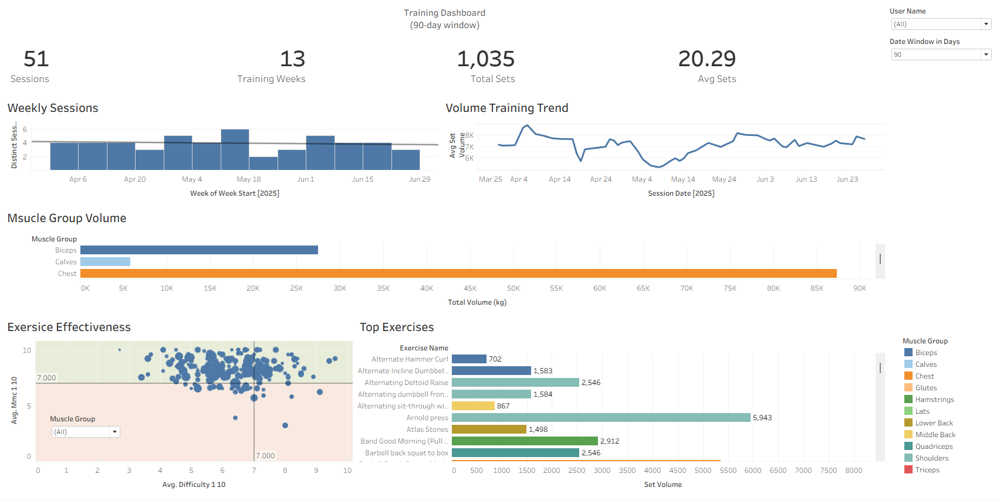

This project uses synthetic but behaviorally realistic data generated in Python to simulate real-world coaching analytics.

Dashboards included:

• Nutrition adherence & macro tracking
• User progress (bodyfat, weight, waist)
• Training volume & effectiveness

This project demonstrates an end-to-end analytics solution built from scratch using
synthetic but realistic data. The dashboards below support coaching and performance
decisions through KPI tracking and trend analysis.

## Dashboards

### Nutrition Dashboard

### User Progress Dashboard

### Training Analytics Dashboard

